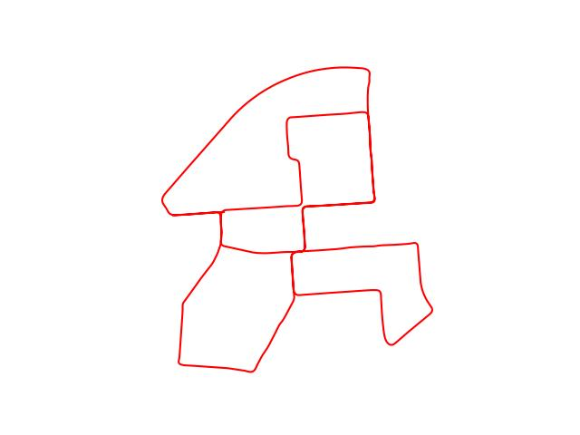
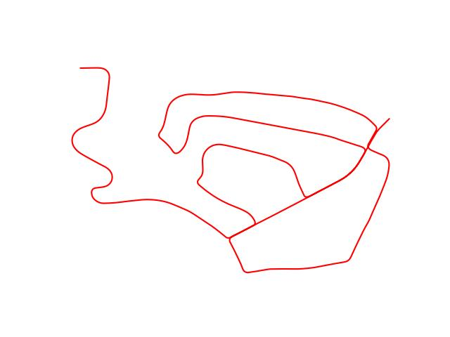
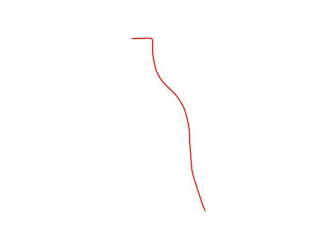
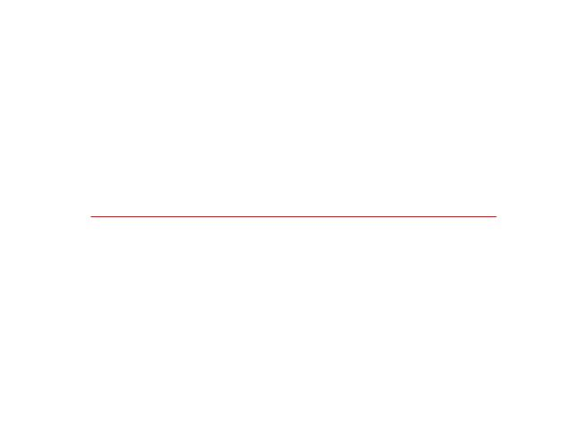
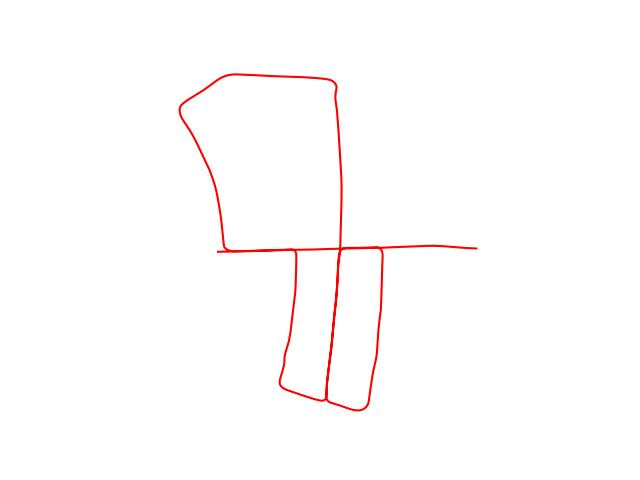
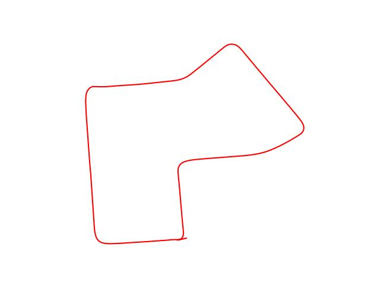
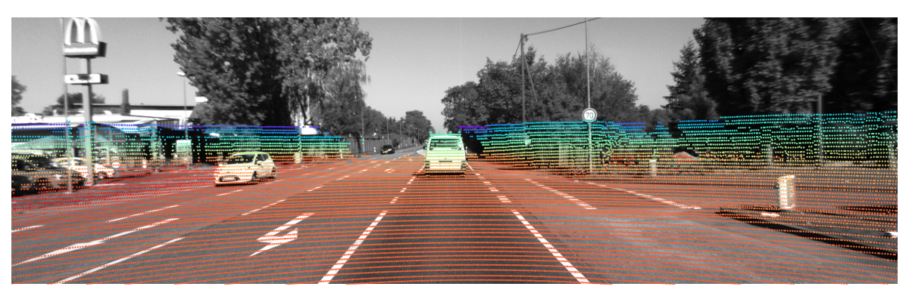

# Spatial-Temporal-LiDAR-camera-Calibration
Official Implementation of **Motion-based Lidar-camera Calibration via Cross-modality Structure Consistency**.

# Paper
* [Techrxiv](https://www.techrxiv.org/articles/preprint/Motion-based_Lidar-camera_Calibration_via_Cross-Modality_Structure_Consistency/23995866)
# KITTI Trajectory
|00|02|03|
|---|---|---|
||||

|04|05|07|
|---|---|---|
||||

These trajectories are not suitable for hand-eye calibration because of lack of adequent rotations around at least two directions. Other hybrid methods may also suffer from the bad initial extrinsic estimation from hand-eye calibration. We believe this proposed method offers a valuable tool to resolve this problem.
# Performance on KITTI Odometry
* `rotation units`: degree
* `translation units`: cm

|Sequence| Roll | Pitch | Yaw| tX| tY| tZ|
|---|---|---|---|---|---|---|
|00|-0.12|-0.22|-0.07|2.93|1.59|0.18|
|02|-0.01|-0.25|-0.16|-2.80|1.63|1.18|
|03|-0.08|-0.10|-0.09|-3.25|3.23|1.22|
|00|0.01|-0.09|0.05|1.03|-0.19|1.10|
|05|0.01|-0.19|-0.15|1.95|1.56|-0.54|
|07|-0.05|-0.00|-0.20|1.07|2.07|0.14|

* An example calibration on Sequence 04

| Ours| Ground-truth|
|---|---|
|||

# Tested Environment
|C++|CMake|g++|python|System|
|---|---|---|---|---|
|C++ 17| CMake 3.25| 9.4.0| 3.8| Ubuntu 20.00|

More recent version would be OK. 
# Dependencies
* [Eigen 3](http://eigen.tuxfamily.org/) (`libeigen3-dev`)
* [OpenMP](https://github.com/llvm-mirror/openmp) (`libomp-dev`)
* [OpenCV 4.x](http://opencv.org/)
* [Pangolin](https://github.com/stevenlovegrove/Pangolin) (visual tools for ORB_SLAM2)
* [g2o 2023](https://github.com/RainerKuemmerle/g2o/releases/tag/20230223_git) (`-DG2O_USE_OPENMP=ON`)
* [Open3D](https://github.com/isl-org/Open3D) (Point Cloud IO, ICP)
* [Nomad](https://github.com/bbopt/nomad) (Global Optimization Algorithm)
# Install
* Copy [Thirdparty](https://github.com/UZ-SLAMLab/ORB_SLAM3/tree/master/Thirdparty) and [Vocabulary](https://github.com/UZ-SLAMLab/ORB_SLAM3/tree/master/Vocabulary) directories to [src/orb_slam/](./src/orb_slam/) <details>
  <summary>Troubleshooting</summary>
  Note that the implementation of ORB_SLAM2 in our repo is different from the original one, so DO NOT copy the whole ORB_SLAM2 repo to replace our directory</details>
* Build and Compile: `cd build && cmake .. -Wno-dev && make -j` <details>
  <summary>TroubleShooting</summary>
  If you have installed g2o through ROS (if you have ROS packages like `base_local_planner`/`teb_local_planner`/`mpc_local_planner`), please exclude it from    LD_LIBRARY_PATH environment variable, or `source config/settings.sh`.   </details>

## Step 1: Estimate Camera and Lidar Poses
### orb_slam
An example command for KITTI 00 Sequence:
```
./orb_store ../data/00/ ../config/orb_ori/KITTI00-02.yaml ../data/Vocabulary/ORBvoc.txt ../KITTI-00/slam_res/Twc.txt ../KITTI-00/KeyFrames/ ../KITTI-00/Map.yml 1.5
```
* `../data/00/`: sequence directory of KITTI Sequence 00
* `../config/orb_ori/KITTI00-02.yaml`: yaml file for ORB_SLAM
* `../data/Vocabulary/ORBvoc.txt`: DBoW2 Vocabulary txt file for ORB_SLAM
* `../KITTI-00/slam_res/Twc.txt`: KeyFrame poses saved by ORB_SLAM, in KITTI format
* `../KITTI-00/KeyFrames/`: KeyFrame information saved by ORB_SLAM, can be restored during runtime
* `../KITTI-00/Map.yml`: Map saved by ORB_SLAM, can be restored during runtime
* `1.5`: Slow Rate of ORB_SLAM2. Duration between Frames: computation + wait_time >= 1.5 * real timestamp

### F-LOAM
an example command for KITTI 00 Sequence:
```
./floam_run ../data/00/velodyne/ ../KITTI-00/slam_res/floam_raw_00.txt
```
* `../data/00/velodyne/`: directory containing the Lidar PointClouds, whose filenames must be sorted by timestamp.
* `../KITTI-00/slam_res/floam_raw_00.txt`: Lidar Poses Estimated by F-LOAM. 
<details><summary>Note</summary>Note that the number of Lidar Poses is not equal to Camera poses because ORB_SLAM only saved KeyFrame Poses. However, the File Id (FrameId) of these KeyFrames are saved to 'FrameId.yml' in the same directory of 'Map.yml'</details>

### F-LOAM Backend Optimization
An example command for KITTI 00 Sequence:
```
 ./floam_backend ../config/loam/backend.yml ../KITTI-00/slam_res/floam_raw_00.txt ../data/00/velodyne/
 ```
 * `../config/loam/backend.yml`: config file of backend optimzation
 * `../KITTI-00/slam_res/floam_raw_00.txt`: Lidar poses estimated by F-LOAM
 * `../data/00/velodyne/`: directory containing the Lidar PointClouds, whose filenames must be sorted by timestamp.

### Expected Results
* `../KITTI-00/KeyFrames`: KeyFrame directory includes information of KeyFrames
* `../KITTI-00/Map.yml`: Visual Map built by ORB_SLAM
* `../KITTI-00/FrameId.yml`: Yaml file that contains Frame indicces of KeyFrames (will saved in the same directory of "Map.yml"
* `../KITTI-00/slam_res/Twc.txt`: KeyFrame Poses estimated by ORB_SLAM
* `../KITTI-00/slam_res/floam_raw_00.txt`: Lidar Poses estimated by F-LOAM (the number of itmes in this file is not equal to that in `Twc.txt`)
* `../KITTI-00/slam_res/floam_isam_00.txt`: Lidar Poses Optimized by iSAM ((the number of itmes in this file is not equal to that in `Twc.txt` but equal to `floam_raw_00.txt`

## Hand-eye Calibration with Regularization
An example command for KITTI 00 Sequence:
```
 ./he_calib ../config/calib/00/he_calib.yml
```
* A file with 13 entries will be saved to `../KITTI/calib_res/he_rb_calib_00.txt`.
* The calibration result of the orindary hand-eye calibration is also saved for checking: `../KITTI/calib_res/he_calib_00.txt`.
## Global optimization
`Nomad` library must be correctly **installed** before this step.

An example command for KITTI 00 Sequence:
```
 ./iba_global ../config/calib/00/iba_calib_global.yml
```
The final calibration result will be saved to `../KITTI-00/calib_res/iba_global_pl_00.txt`
Two parameters in `../config/calib/00/iba_calib_global.yml` are used to create variants for ablation experiments:
```yaml
runtime:
  err_weight: [1.0, 1.0]
  use_plane: true
```
* set `use_plane` to `true` and `err_weight` to `[1.0,1.0]` to apply `CBA+CA (PT+PL)` method in Table 1 of our paper (proposed).
* set `use_plane` to `false` and `err_weight` to `[1.0,1.0]` to apply `CBA+CA (PT)` method in Table 1 of our paper.
* set `use_plane` to `false` and `err_weight` to `[1.0,0.0]` to apply `CBA` method in Table 1 of our paper.

Remember to set different
```yaml
io:
  ResFile: calib_res/iba_global_baonly_00.txt
```
for different methods, or the prior files will be overwritten.

## Parameters that need to be changed in other sequences
* `../data/00/` -> `../data/xx/` for the `orb_store` program; 
* `../config/orb_ori/KITTI00-02.yaml` -> `../config/orb_ori/KITTIxx-xx.yaml`; 
* `KITTI-00` -> `KITTI-xx` for all aurgments; 
* `../data/00/velodyne/` -> `../data/xx/velodyne/`; 
* `floam_raw_00.txt` -> `floam_raw_xx.txt`; 
* `floam_isam_00.txt` -> `floam_isam_xx.txt`; 
